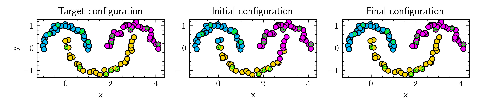

## VolumeMBO_OS

[](https://opensource.org/licenses/MIT)
[](https://github.com/fabiuskt/VolumeMBO_OS/actions)


`volumembo` is a python package providing an implementation of an "efficient volume-preserving MBO scheme for data clustering and classification" discussed in [Krämer, Laux, arXiv:2412.17694 (2024)](#-literature). `volumembo` also provides a C++ backend with an efficient implementation of the volume-preserving MBO scheme.

## 💻 Installation

### Prerequisites

Using `volumembo` requires the following software installed:

* Python `>= 3.10`

In order to build the package from source, the following tools are also needed:

* A C++20-compliant compiler

### Building from source using pip

The following sequence of commands is used to build `volumeMBO` from source:

```
git clone https://github.com/fabiuskt/VolumeMBO_OS
cd VolumeMBO_OS
python -m pip install .
```

⚡ Optional: Faster installation using [uv](https://docs.astral.sh/uv/)

uv is a drop-in replacement for pip and virtualenv that provides extremely fast package installation and dependency resolution.

```
python -m uv pip install .
```

#### Development installation

If you intend to contribute to the development of volumembo, we recommend a locally compiled version using these instructions:

```
git clone --recurse-submodules https://github.com/fabiuskt/VolumeMBO_OS
cd VolumeMBO_OS
python -m uv pip install -r requirements-dev.txt
python -m uv pip install --no-build-isolation --config-settings=build-dir="build" --config-settings=cmake.define.BUILD_TESTS="ON" -v -e .
```

This clones the repository including all submodules, installs the `volumembo` package, exposes the CMake build directory as `build`, and builds tests. The `-e` (editable) flag allows the change of Python sources of `volumembo` without reinstalling the package. The `-v` flag enables verbose output which gives you detailed information about the compilation process that you should include into potential bug reports. To recompile the C++ source, please re-run `uv pip install`.

### Demo

[]()
[]()

## 📚 Literature
Krämer, F., and Laux, T., "An efficient volume-preserving MBO scheme for data clustering and classification." arXiv:2412.17694 (2024). DOI: [10.48550/arXiv.2412.17694](https://doi.org/10.48550/arXiv.2412.17694)

## 📜 License

See [LICENSE.md](LICENSE.md).
